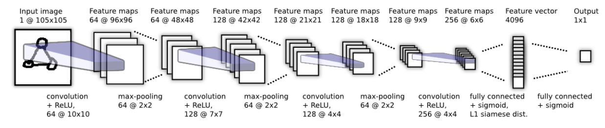
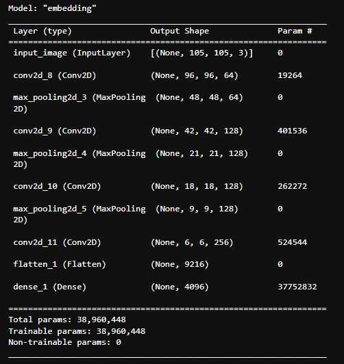
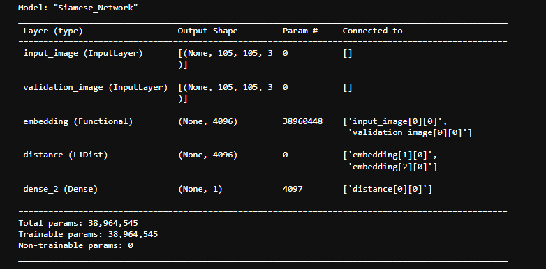
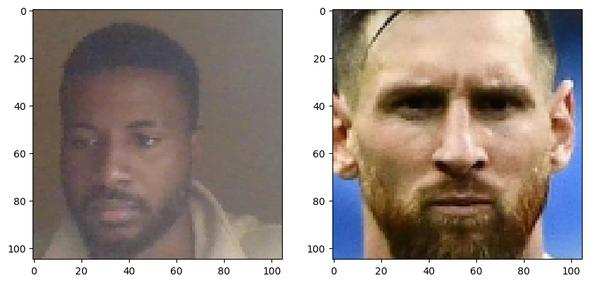
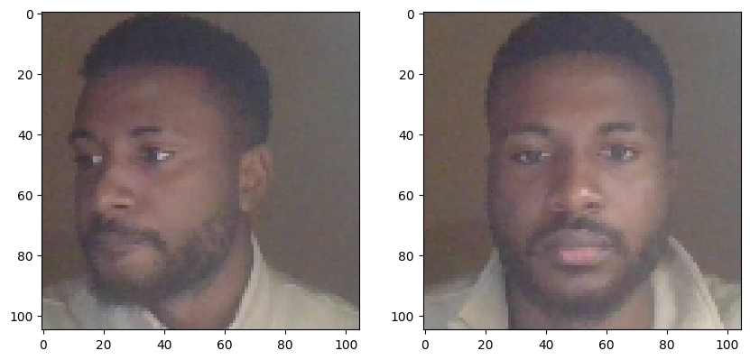
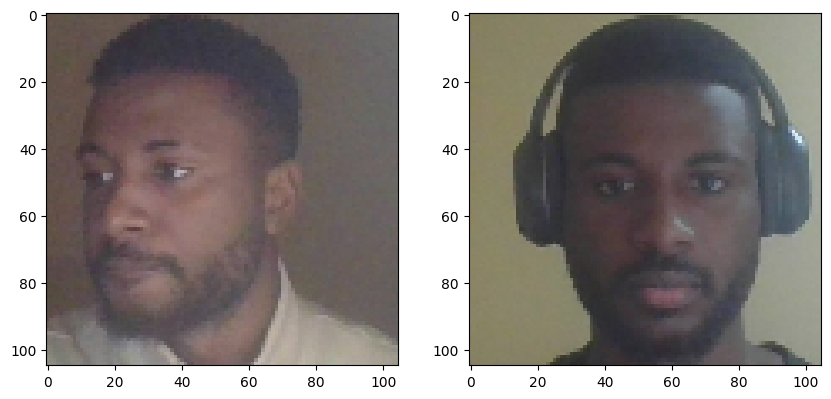

# Siamese Neural Networks for One-shot Image Recognition

This project is an implementation of the "Siamese Neural Networks for One-shot Image Recognition" paper from scratch. Instead of using the Omniglot dataset, I created a custom dataset consisting of images of myself (collected via webcam) and celebrities (randomly downloaded from the internet).

## Table of Contents

- [Project Overview](#project-overview)
- [Installation](#installation)
- [Data Preprocessing](#data-preprocessing)
- [Model Architecture](#model-architecture)
- [Distance Layer](#distance-layer)
- [Key Formula](#key-formula)
- [Checkpoints](#checkpoints)
- [Training](#training)
- [Evaluation](#evaluation)
- [Testing](#testing)
- [Issues](#issues)

## Project Overview

The images are stored in three directories:

1. **Anchor:** Images of myself, captured via webcam.
2. **Positive:** Similar images, also captured via webcam, which serve as the ground truth.
3. **Negative:** Dissimilar images of celebrities, collected randomly from the internet.

This structure is used to simulate a one-shot learning scenario where the model learns to differentiate between similar and dissimilar images.

## Installation

To run this project, install the following packages:

```python
git clone https://github.com/codeflamer/POSE-ESTIMATION.git
pip install tensorflow==2.10.1 matplotlib opencv-python numpy pathlib
```

## Data Preprocessing

The dataset is structured into three folders:

1. **Anchor**: Contains images of myself collected using the webcam.
2. **Positive**: Contains additional images of myself, also collected using the webcam, which serve as the ground truth for similarity.
3. **Negative**: Contains images of celebrities, downloaded from the internet, used to represent dissimilar images.

### Preprocessing Steps

1. **Loading Images**:
   - Images from the `Anchor`, `Positive`, and `Negative` directories were loaded using `tensorflow`'s `tf.data.Dataset` API.
2. **Decoding and Resizing**:

   - Each image was decoded from its raw format, resized to the shape `(105, 105, 3)` to ensure uniformity across the dataset, and rescaled to a range of `[0, 1]` for efficient training.

3. **Creating Triplets**:

   - The datasets were paired to create triplet datasets:
     - `dataset(anchor, positive, label=1)` – pairs of similar images.
     - `dataset(anchor, negative, label=0)` – pairs of dissimilar images.

4. **Batching and Prefetching**:
   - The datasets were cached for efficient loading, shuffled, batched, and prefetched to improve performance during training.

### Example of Dataset Structure:

- **Anchor**: `[image1_anchor, image2_anchor, ...]`
- **Positive**: `[image1_positive, image2_positive, ...]`
- **Negative**: `[image1_negative, image2_negative, ...]`

By structuring and preprocessing the images in this way, the dataset was optimized for training the Siamese Neural Network.

## Model Architecture

The model architecture follows the structure described in the original paper, **Siamese Neural Networks for One-shot Image Recognition**. The architecture was implemented using TensorFlow's Functional API for flexibility and robustness.



### Architecture Overview:

1. **Input Layer**:
   - Input shape: `(105, 105, 3)` representing RGB images with dimensions 105x105 pixels.
2. **Convolutional Block 1**:

   - **Convolutional Layer**: 64 filters, kernel size `(10, 10)`, activation function: `ReLU`.
   - **Max Pooling Layer**: Pool size `(2, 2)`.

3. **Convolutional Block 2**:

   - **Convolutional Layer**: 128 filters, kernel size `(7, 7)`, activation function: `ReLU`.
   - **Max Pooling Layer**: Pool size `(2, 2)`.

4. **Convolutional Block 3**:

   - **Convolutional Layer**: 128 filters, kernel size `(4, 4)`, activation function: `ReLU`.
   - **Max Pooling Layer**: Pool size `(2, 2)`.

5. **Convolutional Block 4**:
   - **Convolutional Layer**: 256 filters, kernel size `(4, 4)`, activation function: `ReLU`.
   - **Flatten Layer**: Converts the 2D matrix into a 1D vector.

### Model Summary for One Network:



Each of these blocks processes the input image, creating an **embedding** (a numerical representation) of the image. This process is performed by two identical networks, one for the `Anchor` image and one for the comparison image (`Positive` or `Negative`).

### Distance Calculation:

- The **Distance Layer** computes the absolute difference between the embeddings produced by the two networks.

### Output Layer:

- The final layer is a **Dense Layer** with a sigmoid activation function, which outputs the **probability of similarity** between the two images (with values between 0 and 1).



### Key Concept:

The core idea of the Siamese Neural Network is to compare the two images by computing the distance between their embeddings and determining whether they are similar or dissimilar based on that distance.

## Distance Layer

The **Distance Layer** is the key component that determines the similarity between two images by calculating the absolute difference between the embeddings generated by the two neural networks.

### Process:

1. **Embedding Comparison**:

   - The two identical neural networks process the `Anchor` and `Positive/Negative` images, generating two embeddings (one from each network).
   - These embeddings are high-dimensional vectors that represent the features of the images.

2. **Absolute Difference**:

   - The **Distance Layer** calculates the **absolute difference** between the two embeddings, which represents the dissimilarity between the images.

3. **Dense Layer**:
   - The output from the Distance Layer is passed through a **Dense Layer** with a single unit and a **Sigmoid Activation Function**.
   - This layer converts the distance into a **probability** that indicates how similar the two images are:
     - A probability close to 1 means the images are similar.
     - A probability close to 0 means the images are dissimilar.

## Key Formula:

\[
\text{Similarity Score} = \sigma\left(W \cdot |embedding_1 - embedding_2|\right)
\]
Where:

- \( W \) are the learned weights of the Dense Layer.
- \( \sigma \) is the Sigmoid Activation Function.

## Checkpoints

During training, checkpoints were established to save the model at various stages. This ensures that in the event of any interruption, the training can resume from the last saved state.

## Training

- **Loss Function:** Binary Cross-Entropy.
- **Optimizer:** Adam Optimizer (Keras).
- **Training Duration:** 50 epochs, with 170 images per category (510 images in total).

## Evaluation

- **Metrics:** Recall and Precision.
- The model achieved a high score, close to 1, indicating strong performance.

## Testing

For testing, images from the test dataset were passed into the model. For example, a picture of myself and Lionel Messi was fed into the model, which correctly predicted them as dissimilar (output = 0).



A picture of myself and me was fed into the model, which correctly predicted them as similar (output = 1)


A picture of myself and me(with headset) was fed into the model, which does not correctly predicted me (output = 0)


## Issues

Due to the small number of training epochs and the small dataset available and not with a lot of variations. The model doesn't learn all the necessary features and sometimes does not even recgonize me in when the lightning is bad or when i have my headset on (hahhah).
